## Project Overview

Generated using: [gitdiagram.com](https://gitdiagram.com/roapi/roapi)

### 1. Project Type and Purpose
ROAPI is a full-stack Rust application with the following components:
- **Core Query Engine (`columnq`)**: Loads datasets and translates queries into Apache Arrow/Datafusion plans.
- **Server (`roapi`)**: Wraps `columnq` and provides multi-protocol APIs (REST, GraphQL, SQL, FlightSQL, Postgres wire, key-value).
- **Web UI (`roapi-ui`)**: Browser-based API query interface.
- **CLI Client (`columnq-cli`)**: Local data exploration using the same engine.

---

### 2. File Structure
#### Top-Level Crates:
- **`columnq-cli/`**: CLI binary.
- **`columnq/`**: Core library (query frontends, data layer, response encoding).
- **`roapi/`**: Server binary (protocol handlers, HTTP server, context, startup).
- **`roapi-ui/`**: WASM/UI static assets served by `roapi`.

#### Shared Config & Orchestration:
- **`.devcontainer/`, `Dockerfile`, `docker-compose.yml`**: Local dev and container setup.
- **`ci/`**: Cloud object store provisioning scripts.
- **GitHub Workflows**: Build, release, and security audit.

#### Test and Sample Data:
- **`test_data/`**: Sample datasets.
- **`test_end_to_end/`**: End-to-end tests.

---

### 3. Key Architectural Insights
- Query frontends for SQL, GraphQL, REST, FlightSQL, Postgres wire.
- Data layer supports multiple formats (CSV, JSON, Parquet, Excel, Delta) and storage backends (FS, HTTP, S3, GCS, Azure, MySQL, SQLite, Postgres).
- Execution engine based on Apache Datafusion.
- Response encoding into JSON, Arrow streams, Parquet, etc.
- Dynamic table registration via HTTP API.
- Built-in Web UI served at `/ui`.

---

### 4. Main Components
#### a. Clients & Interfaces
- CLI (`columnq-cli`).
- Web UI (`roapi-ui` served by `roapi`).
- External clients: REST, GraphQL, SQL, FlightSQL, Postgres wire, key-value HTTP.

#### b. `roapi` Server
- HTTP server layer (`tower-http`).
- Protocol routers: REST, GraphQL, SQL, FlightSQL, Postgres wire.
- Middleware for authentication, logging, and table registration API (`/api/table`).

#### c. `columnq` Engine
- Query frontends (`sql.rs`, `graphql.rs`, `rest.rs`, `flight_sql.rs`).
- Data connectors (`fs.rs`, `http.rs`, `object_store.rs`, `memory.rs`).
- Encoding modules (`arrow.rs`, `csv.rs`, `json.rs`, `parquet.rs`).
- Table abstractions for various formats and connectors.

#### d. Execution Runtime
- Apache Arrow for in-memory data representation.
- Apache Datafusion for query planning and execution.

#### e. Storage & Data Sources
- Local filesystem, HTTP endpoints, S3/GCS/Azure, RDBMS (MySQL, SQLite, Postgres), Google Sheets.
- Test data under `test_data/`.

#### f. CI/CD & DevContainer
- GitHub Actions workflows for build, release, and security audit.
- Docker and DevContainer setup for local development.

---

### 5. Relationships and Data Flows
- **External Client** → `roapi` HTTP server → Protocol router → `columnq` query frontend → Datafusion plan → Data connectors → Arrow record batches → Encoding layer → HTTP response → Client.
- **Web UI**: Served statically by `roapi`, communicates via REST/GraphQL/SQL endpoints.
- **CLI Client**: Directly links against `columnq` library, bypassing the HTTP server.
- **Table Registration API**: Updates in-memory table catalog in `columnq`.

---

### 6. Architectural Patterns
- **Layered Architecture**:
   1. Protocol layer.
   2. Query engine (`columnq`).
   3. Data source abstraction.
   4. Storage/connectors.
- Modular Rust crates for separation of concerns.
- Apache Arrow/Datafusion for in-memory analytics.
- Pluggable frontends and encoders via traits.

---

### 7. Component Mapping

#### 1. CLI Client (`columnq-cli`)
- **Directory**: `columnq-cli/`
- **Main File**: `columnq-cli/src/main.rs`

#### 2. Web UI (`roapi-ui`)
- **Directory**: `roapi-ui/`
- **Source Files**: `roapi-ui/src/{main.rs, app.rs, lib.rs}`
- **Assets**: `roapi-ui/assets/`, `roapi-ui/index.html`, `roapi-ui/Trunk.toml`

#### 3. `roapi` Server
- **HTTP Server**: `roapi/src/server/http/`
- **Protocol Handlers**: `roapi/src/api/`
- **Middleware**: `roapi/src/context.rs`
- **Startup**: `roapi/src/startup.rs`
- **FlightSQL & Postgres Wire**: `roapi/src/server/`

#### 4. `columnq` Core Engine
- **Query Frontends**: `columnq/src/query/`
- **Data Connectors**: `columnq/src/io/`
- **Encoding Modules**: `columnq/src/encoding/`
- **Table Abstractions**: `columnq/src/table/`
- **Utilities**: `columnq/src/{lib.rs, columnq.rs, error.rs}`

#### 5. CI/CD & DevContainer
- **GitHub Actions**: `.github/workflows/`
- **Docker & DevContainer**: `Dockerfile`, `docker-compose.yml`, `.devcontainer/`
- **Cloud Setup Scripts**: `ci/scripts/`

---

### 8. Data Flow Diagram

```mermaid
graph TB
    subgraph "Clients & Interfaces"
        CLI["CLI Client\n(columnq-cli)"]:::frontend
        UI["Web UI\n(roapi-ui)"]:::frontend
        EXT["External Clients\n(REST, GraphQL, SQL, FlightSQL, Postgres, KV)"]:::frontend
    end

    subgraph "roapi Server"
        HTTP["HTTP Server Layer"]:::service
        Context["Context & Middleware"]:::service
        Startup["Startup & Configuration"]:::service

        subgraph "Protocol Handlers"
            REST["REST Handler"]:::service
            GRAPHQL["GraphQL Handler"]:::service
            SQLH["SQL Handler"]:::service
            FLIGHT["FlightSQL Handler"]:::service
            PG["Postgres Wire Handler"]:::service
            KV["Key-Value Handler"]:::service
            REGISTER["Table Registration API"]:::service
        end
    end

    subgraph "columnq Core Engine"
        subgraph "Query Frontends"
            QSQL["SQL Frontend"]:::core
            QGRAPHQL["GraphQL Frontend"]:::core
            QREST["REST Frontend"]:::core
            QMOD["Query Mod.rs"]:::core
        end
        subgraph "Data Layer Connectors"
            IOFS["FS Connector"]:::core
            IOHTTP["HTTP Connector"]:::core
            IOOBJ["Object Store"]:::core
            IOMEM["In-memory"]:::core
        end
        subgraph "Encoding Layer"
            EArrow["Arrow Encoding"]:::core
            ECSV["CSV Encoding"]:::core
            EJSON["JSON Encoding"]:::core
            EPARQ["Parquet Encoding"]:::core
        end
        subgraph "Table Abstractions"
            TBLMOD["Table Mod.rs"]:::core
        end
        ENTRY["Engine Entry & Utils"]:::core
    end

    Datafusion["Datafusion & Arrow Runtime"]:::core

    subgraph "Storage & Data Sources"
        FS["Local FS / HTTP / S3 / GCS / Azure"]:::external
        RDB["RDBMS (MySQL, SQLite, Postgres)"]:::external
        SHEETS["Google Sheets"]:::external
        TESTD["Sample/Test Data"]:::external
        E2E["End-to-End Tests"]:::external
    end

    subgraph "CI/CD & DevContainer"
        GH["GitHub Actions Workflows"]:::infra
        DOCKER["Docker & DevContainer"]:::infra
        CISCRIPTS["Cloud Setup Scripts"]:::infra
    end

    %% Flows
    EXT --> HTTP
    CLI --> ENTRY
    UI --> HTTP
    HTTP --> Context
    HTTP --> REST
    HTTP --> GRAPHQL
    HTTP --> SQLH
    HTTP --> FLIGHT
    HTTP --> PG
    HTTP --> KV
    HTTP --> REGISTER

    REST --> QREST
    GRAPHQL --> QGRAPHQL
    SQLH --> QSQL
    FLIGHT --> QMOD
    PG --> QMOD
    KV --> QMOD

    QSQL --> Datafusion
    QGRAPHQL --> Datafusion
    QREST --> Datafusion
    QMOD --> Datafusion

    Datafusion --> IOFS
    Datafusion --> IOHTTP
    Datafusion --> IOOBJ
    Datafusion --> IOMEM

    IOFS --> FS
    IOHTTP --> FS
    IOOBJ --> FS
    IOMEM --> FS

    IOFS --> RDB
    IOHTTP --> RDB
    IOOBJ --> SHEETS
    IOMEM --> SHEETS

    Datafusion --> EArrow
    Datafusion --> ECSV
    Datafusion --> EJSON
    Datafusion --> EPARQ

    EArrow --> HTTP
    ECSV --> HTTP
    EJSON --> HTTP
    EPARQ --> HTTP

    TBLMOD --> IOMEM
    REGISTER --> TBLMOD

    TESTD --> IOFS
    E2E --> HTTP

    GH --> HTTP
    GH --> ENTRY
    DOCKER --> HTTP
    DOCKER --> ENTRY
    CISCRIPTS --> IOOBJ

    %% Click Events
    click CLI "https://github.com/roapi/roapi/blob/main/columnq-cli/src/main.rs"
    click UI "https://github.com/roapi/roapi/tree/main/roapi-ui/"
    click HTTP "https://github.com/roapi/roapi/blob/main/roapi/src/server/http/mod.rs"
    click Context "https://github.com/roapi/roapi/blob/main/roapi/src/context.rs"
    click Startup "https://github.com/roapi/roapi/blob/main/roapi/src/startup.rs"
    click REST "https://github.com/roapi/roapi/blob/main/roapi/src/api/rest.rs"
    click GRAPHQL "https://github.com/roapi/roapi/blob/main/roapi/src/api/graphql.rs"
    click SQLH "https://github.com/roapi/roapi/blob/main/roapi/src/api/sql.rs"
    click KV "https://github.com/roapi/roapi/blob/main/roapi/src/api/kv.rs"
    click REGISTER "https://github.com/roapi/roapi/blob/main/roapi/src/api/register.rs"
    click FLIGHT "https://github.com/roapi/roapi/blob/main/roapi/src/server/flight_sql.rs"
    click PG "https://github.com/roapi/roapi/blob/main/roapi/src/server/postgres.rs"
    click QSQL "https://github.com/roapi/roapi/blob/main/columnq/src/query/sql.rs"
    click QGRAPHQL "https://github.com/roapi/roapi/blob/main/columnq/src/query/graphql.rs"
    click QREST "https://github.com/roapi/roapi/blob/main/columnq/src/query/rest.rs"
    click QMOD "https://github.com/roapi/roapi/blob/main/columnq/src/query/mod.rs"
    click IOFS "https://github.com/roapi/roapi/blob/main/columnq/src/io/fs.rs"
    click IOHTTP "https://github.com/roapi/roapi/blob/main/columnq/src/io/http.rs"
    click IOOBJ "https://github.com/roapi/roapi/blob/main/columnq/src/io/object_store.rs"
    click IOMEM "https://github.com/roapi/roapi/blob/main/columnq/src/io/memory.rs"
    click EArrow "https://github.com/roapi/roapi/blob/main/columnq/src/encoding/arrow.rs"
    click ECSV "https://github.com/roapi/roapi/blob/main/columnq/src/encoding/csv.rs"
    click EJSON "https://github.com/roapi/roapi/blob/main/columnq/src/encoding/json.rs"
    click EPARQ "https://github.com/roapi/roapi/blob/main/columnq/src/encoding/parquet.rs"
    click TBLMOD "https://github.com/roapi/roapi/blob/main/columnq/src/table/mod.rs"
    click ENTRY "https://github.com/roapi/roapi/blob/main/columnq/src/lib.rs"
    click TESTD "https://github.com/roapi/roapi/tree/main/test_data/"
    click E2E "https://github.com/roapi/roapi/tree/main/test_end_to_end/"
    click GH "https://github.com/roapi/roapi/blob/main/.github/workflows/build.yml"
    click DOCKER "https://github.com/roapi/roapi/blob/main/docker-compose.yml"
    click CISCRIPTS "https://github.com/roapi/roapi/blob/main/ci/scripts/setup_*.sh"

    %% Styles
    classDef frontend fill:#D0E8FF,stroke:#005B96,color:#005B96;
    classDef core fill:#E0F8E0,stroke:#2E8B57,color:#2E8B57;
    classDef external fill:#FFF4E6,stroke:#E08E0B,color:#E08E0B;
    classDef service fill:#E6E6FA,stroke:#9370DB,color:#9370DB;
    classDef infra fill:#F2F2F2,stroke:#A9A9A9,color:#696969;
```

