## Project Overview

Generated using: https://gitdiagram.com/roapi/roapi

### 1. Project Type and Purpose
ROAPI is a full-stack Rust application comprising:
- **Core Query Engine Crate (`columnq`)**: Loads datasets and translates queries into Apache Arrow/Datafusion plans.
- **Server Crate (`roapi`)**: Wraps `columnq` and exposes multi-protocol APIs (REST, GraphQL, SQL, FlightSQL, Postgres wire, key-value).
- **Web UI Front-End Crate (`roapi-ui`)**: Built to query APIs in-browser.
- **Command-Line Client Crate (`columnq-cli`)**: Enables local data exploration using the same engine.

---

### 2. File Structure Analysis
#### Top-Level Crates:
- **`columnq-cli/`**: CLI binary.
- **`columnq/`**: Core library (query frontends, data layer, response encoding).
- **`roapi/`**: Server binary (protocol handlers, HTTP server, context, startup).
- **`roapi-ui/`**: WASM/UI static assets served by `roapi`.

#### Shared Config & Orchestration:
- **`.devcontainer/`, `Dockerfile`, `docker-compose.yml`**: Local dev and container setup.
- **`ci/`**: Scripts to provision cloud object stores (Azure, GCS, MinIO).
- **GitHub Workflows**: Build, release, security audit.

#### Test and Sample Data:
- **`test_data/`**: Test data.
- **`test_end_to_end/`**: End-to-end tests.

### 3. Key Architectural Insights
- Query frontends for SQL, GraphQL, REST, FlightSQL, Postgres wire.
- Data layer modules for various formats (CSV, JSON, Parquet, Excel, Delta, spreadsheets) and storage backends (FS, HTTP, S3, GCS, Azure, MySQL, SQLite, Postgres).
- Execution engine based on Datafusion (Arrow record batches).
- Response encoding layer to serialize into JSON, Arrow streams, Parquet, etc.
- Dynamic table registration via HTTP API.
- Built-in Web UI served at `/ui`.

---

### 4. Main Components for the System-Design Diagram
#### a. Clients & Interfaces
- CLI client (`columnq-cli`).
- Web UI (`roapi-ui` served by `roapi`).
- External clients: HTTP/REST, GraphQL, SQL over HTTP, FlightSQL, Postgres wire, key-value HTTP.

#### b. `roapi` Server
- HTTP server layer (`tower-http`).
- Protocol routers: REST, GraphQL, SQL, FlightSQL, Postgres wire.
- Context & middleware layers (authentication placeholder, logging).
- Table registration API (`/api/table`).

#### c. `columnq` Engine
- Query frontend modules (`sql.rs`, `graphql.rs`, `rest.rs`, `flight_sql.rs`).
- Data layer modules (`fs.rs`, `http.rs`, `object_store.rs`, `memory.rs`).
- Encoding layer modules (`arrow.rs`, `csv.rs`, `json.rs`, `parquet.rs`).
- Table abstractions (arrow_ipc, csv, excel, delta, google_sheets, database connectors).
- Error handling, utilities, test utilities.

#### d. Execution Runtime
- Apache Arrow in-memory data representation.
- Apache Datafusion query planner & executor.

#### e. Storage & Data Sources
- Local filesystem, HTTP endpoints, S3/GCS/Azure stores, RDBMS (MySQL, SQLite, Postgres), Google Sheets.
- Sample/test data under `test_data/`.

#### f. CI/CD & DevContainer
- GitHub Actions workflows (build, release, security audit).
- Dockerfile, `docker-compose`, `devcontainer.json` for local development.

---

### 5. Relationships and Data Flows
- **External Client** → `roapi` HTTP server → Protocol router → `columnq` query frontend → Datafusion plan → Data layer connectors → Arrow record batches → Encoding layer → `roapi` HTTP response → Client.
- **Web UI**: Served statically by `roapi`, communicates via REST/GraphQL/SQL endpoints.
- **CLI Client**: Links directly against `columnq` library, bypassing HTTP server.
- **Table Registration API**: Writes to in-memory table catalog in `columnq` engine.

---

### 6. Architectural Patterns & Design Principles
- **Layered Architecture**:
    1. Protocol layer.
    2. Business logic/query engine layer (`columnq`).
    3. Data source abstraction layer.
    4. Storage/connectors layer.
- Modular Rust crates to isolate concerns.
- Use of Arrow/Datafusion for in-memory columnar analytics.
- Pluggable frontends and encoders via trait abstractions.

#### Color Code:
- **Blue**: User-facing components (UI, CLI, HTTP endpoints).
- **Green**: Core engine/crates (`columnq`, Datafusion).
- **Orange**: External systems/connectors (S3, GCS, database).
- **Grey**: Infrastructure (CI/CD, Docker, DevContainer).

### 7. Component Mapping:

1. CLI Client ("columnq-cli"): columnq-cli/  
   - columnq-cli/src/main.rs

2. Web UI ("roapi-ui"): roapi-ui/  
   - roapi-ui/src/{main.rs, app.rs, lib.rs}  
   - roapi-ui/assets/, roapi-ui/index.html, roapi-ui/Trunk.toml

3. roapi Server  
   a. HTTP Server Layer: roapi/src/server/http/  
      - layers.rs  
      - ui.rs  
      - mod.rs  
   b. Protocol Routers / API Handlers: roapi/src/api/  
      - rest.rs  
      - graphql.rs  
      - sql.rs  
      - kv.rs  
      - register.rs  
      - routes.rs  
      - schema.rs  
   c. Context & Middleware:  
      - roapi/src/context.rs  
      - roapi/src/server/http/layers.rs  
   d. Startup & Configuration:  
      - roapi/src/startup.rs  
      - roapi/src/config.rs  
   e. FlightSQL & Postgres Wire:  
      - roapi/src/server/flight_sql.rs  
      - roapi/src/server/postgres.rs

4. columnq Core Engine  
   a. Query Frontends: columnq/src/query/  
      - sql.rs  
      - rest.rs  
      - graphql.rs  
      - mod.rs  
   b. Data Layer / IO Connectors: columnq/src/io/  
      - fs.rs  
      - http.rs  
      - object_store.rs  
      - memory.rs  
      - mod.rs  
   c. Encoding Layer: columnq/src/encoding/  
      - arrow.rs  
      - csv.rs  
      - json.rs  
      - parquet.rs  
      - mod.rs  
   d. Table Abstractions: columnq/src/table/  
      - arrow_ipc_file.rs  
      - arrow_ipc_stream.rs  
      - csv.rs  
      - excel.rs  
      - delta.rs  
      - google_spreadsheets.rs  
      - json.rs  
      - ndjson.rs  
      - parquet.rs  
      - database.rs  
      - mod.rs  
   e. Engine Entry Point & Utilities:  
      - columnq/src/lib.rs  
      - columnq/src/columnq.rs  
      - columnq/src/error.rs  
      - columnq/src/test_util.rs

5. Execution Runtime  
   - (Apache Arrow & Datafusion invoked via columnq/src/lib.rs; no dedicated files)

6. Storage & Sample Data  
   - test_data/  
   - test_end_to_end/

7. CI/CD & DevContainer  
   - GitHub Actions: .github/workflows/{build.yml, columnq_cli_release.yml, roapi_release.yml, scheduled_security_audit.yml}  
   - Docker & DevContainer: Dockerfile, docker-compose.yml, .devcontainer/{devcontainer.json, db-migration.sql}  
   - Cloud setup scripts: ci/scripts/{setup_*.sh, populate_*.sh}

```mermaid
graph TB
    subgraph "Clients & Interfaces"
        CLI["CLI Client\n(columnq-cli)"]:::frontend
        UI["Web UI\n(roapi-ui)"]:::frontend
        EXT["External Clients\n(REST, GraphQL, SQL, FlightSQL, Postgres, KV)"]:::frontend
    end

    subgraph "roapi Server"
        HTTP["HTTP Server Layer"]:::service
        Context["Context & Middleware"]:::service
        Startup["Startup & Configuration"]:::service

        subgraph "Protocol Handlers"
            REST["REST Handler"]:::service
            GRAPHQL["GraphQL Handler"]:::service
            SQLH["SQL Handler"]:::service
            FLIGHT["FlightSQL Handler"]:::service
            PG["Postgres Wire Handler"]:::service
            KV["Key-Value Handler"]:::service
            REGISTER["Table Registration API"]:::service
        end
    end

    subgraph "columnq Core Engine"
        subgraph "Query Frontends"
            QSQL["SQL Frontend"]:::core
            QGRAPHQL["GraphQL Frontend"]:::core
            QREST["REST Frontend"]:::core
            QMOD["Query Mod.rs"]:::core
        end
        subgraph "Data Layer Connectors"
            IOFS["FS Connector"]:::core
            IOHTTP["HTTP Connector"]:::core
            IOOBJ["Object Store"]:::core
            IOMEM["In-memory"]:::core
        end
        subgraph "Encoding Layer"
            EArrow["Arrow Encoding"]:::core
            ECSV["CSV Encoding"]:::core
            EJSON["JSON Encoding"]:::core
            EPARQ["Parquet Encoding"]:::core
        end
        subgraph "Table Abstractions"
            TBLMOD["Table Mod.rs"]:::core
        end
        ENTRY["Engine Entry & Utils"]:::core
    end

    Datafusion["Datafusion & Arrow Runtime"]:::core

    subgraph "Storage & Data Sources"
        FS["Local FS / HTTP / S3 / GCS / Azure"]:::external
        RDB["RDBMS (MySQL, SQLite, Postgres)"]:::external
        SHEETS["Google Sheets"]:::external
        TESTD["Sample/Test Data"]:::external
        E2E["End-to-End Tests"]:::external
    end

    subgraph "CI/CD & DevContainer"
        GH["GitHub Actions Workflows"]:::infra
        DOCKER["Docker & DevContainer"]:::infra
        CISCRIPTS["Cloud Setup Scripts"]:::infra
    end

    %% Flows
    EXT --> HTTP
    CLI --> ENTRY
    UI --> HTTP
    HTTP --> Context
    HTTP --> REST
    HTTP --> GRAPHQL
    HTTP --> SQLH
    HTTP --> FLIGHT
    HTTP --> PG
    HTTP --> KV
    HTTP --> REGISTER

    REST --> QREST
    GRAPHQL --> QGRAPHQL
    SQLH --> QSQL
    FLIGHT --> QMOD
    PG --> QMOD
    KV --> QMOD

    QSQL --> Datafusion
    QGRAPHQL --> Datafusion
    QREST --> Datafusion
    QMOD --> Datafusion

    Datafusion --> IOFS
    Datafusion --> IOHTTP
    Datafusion --> IOOBJ
    Datafusion --> IOMEM

    IOFS --> FS
    IOHTTP --> FS
    IOOBJ --> FS
    IOMEM --> FS

    IOFS --> RDB
    IOHTTP --> RDB
    IOOBJ --> SHEETS
    IOMEM --> SHEETS

    Datafusion --> EArrow
    Datafusion --> ECSV
    Datafusion --> EJSON
    Datafusion --> EPARQ

    EArrow --> HTTP
    ECSV --> HTTP
    EJSON --> HTTP
    EPARQ --> HTTP

    TBLMOD --> IOMEM
    REGISTER --> TBLMOD

    TESTD --> IOFS
    E2E --> HTTP

    GH --> HTTP
    GH --> ENTRY
    DOCKER --> HTTP
    DOCKER --> ENTRY
    CISCRIPTS --> IOOBJ

    %% Click Events
    click CLI "https://github.com/roapi/roapi/blob/main/columnq-cli/src/main.rs"
    click UI "https://github.com/roapi/roapi/tree/main/roapi-ui/"
    click HTTP "https://github.com/roapi/roapi/blob/main/roapi/src/server/http/mod.rs"
    click Context "https://github.com/roapi/roapi/blob/main/roapi/src/context.rs"
    click Startup "https://github.com/roapi/roapi/blob/main/roapi/src/startup.rs"
    click REST "https://github.com/roapi/roapi/blob/main/roapi/src/api/rest.rs"
    click GRAPHQL "https://github.com/roapi/roapi/blob/main/roapi/src/api/graphql.rs"
    click SQLH "https://github.com/roapi/roapi/blob/main/roapi/src/api/sql.rs"
    click KV "https://github.com/roapi/roapi/blob/main/roapi/src/api/kv.rs"
    click REGISTER "https://github.com/roapi/roapi/blob/main/roapi/src/api/register.rs"
    click FLIGHT "https://github.com/roapi/roapi/blob/main/roapi/src/server/flight_sql.rs"
    click PG "https://github.com/roapi/roapi/blob/main/roapi/src/server/postgres.rs"
    click QSQL "https://github.com/roapi/roapi/blob/main/columnq/src/query/sql.rs"
    click QGRAPHQL "https://github.com/roapi/roapi/blob/main/columnq/src/query/graphql.rs"
    click QREST "https://github.com/roapi/roapi/blob/main/columnq/src/query/rest.rs"
    click QMOD "https://github.com/roapi/roapi/blob/main/columnq/src/query/mod.rs"
    click IOFS "https://github.com/roapi/roapi/blob/main/columnq/src/io/fs.rs"
    click IOHTTP "https://github.com/roapi/roapi/blob/main/columnq/src/io/http.rs"
    click IOOBJ "https://github.com/roapi/roapi/blob/main/columnq/src/io/object_store.rs"
    click IOMEM "https://github.com/roapi/roapi/blob/main/columnq/src/io/memory.rs"
    click EArrow "https://github.com/roapi/roapi/blob/main/columnq/src/encoding/arrow.rs"
    click ECSV "https://github.com/roapi/roapi/blob/main/columnq/src/encoding/csv.rs"
    click EJSON "https://github.com/roapi/roapi/blob/main/columnq/src/encoding/json.rs"
    click EPARQ "https://github.com/roapi/roapi/blob/main/columnq/src/encoding/parquet.rs"
    click TBLMOD "https://github.com/roapi/roapi/blob/main/columnq/src/table/mod.rs"
    click ENTRY "https://github.com/roapi/roapi/blob/main/columnq/src/lib.rs"
    click TESTD "https://github.com/roapi/roapi/tree/main/test_data/"
    click E2E "https://github.com/roapi/roapi/tree/main/test_end_to_end/"
    click GH "https://github.com/roapi/roapi/blob/main/.github/workflows/build.yml"
    click DOCKER "https://github.com/roapi/roapi/blob/main/docker-compose.yml"
    click CISCRIPTS "https://github.com/roapi/roapi/blob/main/ci/scripts/setup_*.sh"

    %% Styles
    classDef frontend fill:#D0E8FF,stroke:#005B96,color:#005B96;
    classDef core fill:#E0F8E0,stroke:#2E8B57,color:#2E8B57;
    classDef external fill:#FFF4E6,stroke:#E08E0B,color:#E08E0B;
    classDef service fill:#E6E6FA,stroke:#9370DB,color:#9370DB;
    classDef infra fill:#F2F2F2,stroke:#A9A9A9,color:#696969;
```

